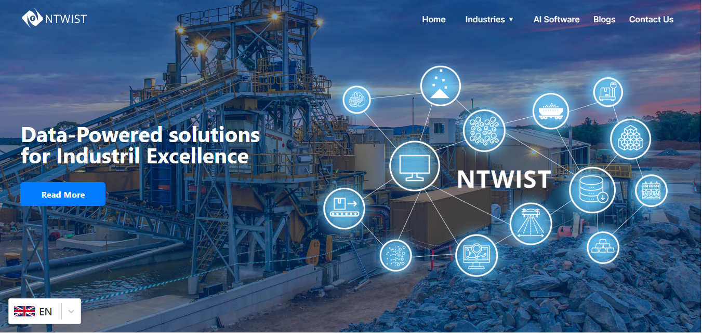
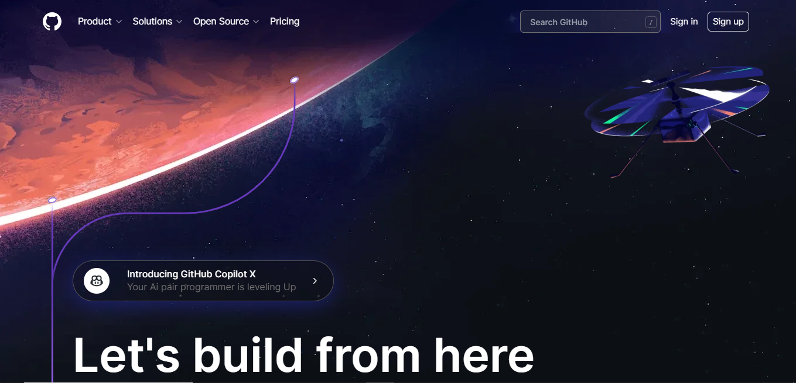

# Ntwist & Github Homepage Clone

This repository contains the code for the HomePage of Application (Ntwist.com & github.com) The application allows users to Visualise Homepage with animated Effect. It consists Only frontend components.

## Prerequisites

- Node.js (v12 or higher)

## Getting Started

1. Clone the repository:
    ```
    git clone https://github.com/Asimji/finmee_assessment.git
    cd finmee_assessment
    ```


2. Install dependencies for both frontend and backend:

    ```
    cd ntwist
    npm install
    ```
    
    ```
    cd githome
    npm install
    ```


4. Start the frontend development server:

1. Ntwist
    ```
    cd ntwist
    npm start
    ```
    The frontend will run on `https://ntwist-bay.vercel.app/`.

               
1. Githome
    ```
    cd githome
    npm start
    ```

    The frontend will run on `https://githome-peach.vercel.app/`.


## Frontend

The frontend is built using React.js and Chakra UI for the user interface.
1. Ntwist 


2. Github



## Deployed URL
Ntwist Homepage Clone -
The web application is deployed at: https://ntwist-bay.vercel.app/

Github Homepage Clone -
The web application is deployed at: https://githome-peach.vercel.app/

## Dependencies

### Frontend

- react: JavaScript library for building user interfaces
- react-dom: Integration of React with the DOM
- fetch: Promise-based HTTP client for making API requests
- @chakra-ui/react: UI component library for React
- framer-motion: Library for animations in React


## Contributing

If you find any issues or have suggestions for improvement, feel free to open an issue or submit a pull request.

## License

This project is licensed under the MIT License - see the LICENSE for details.


